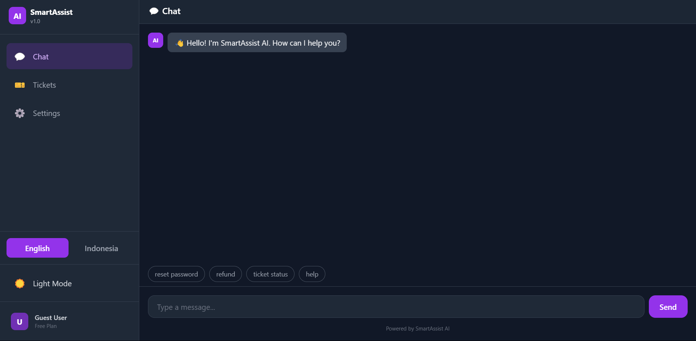
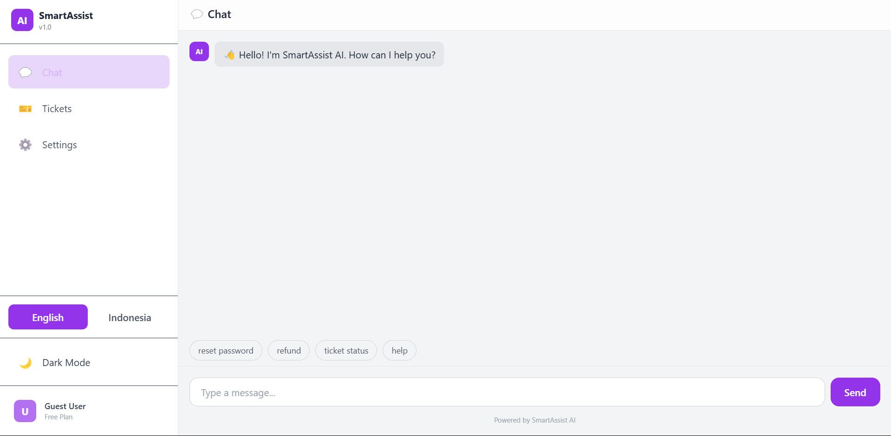
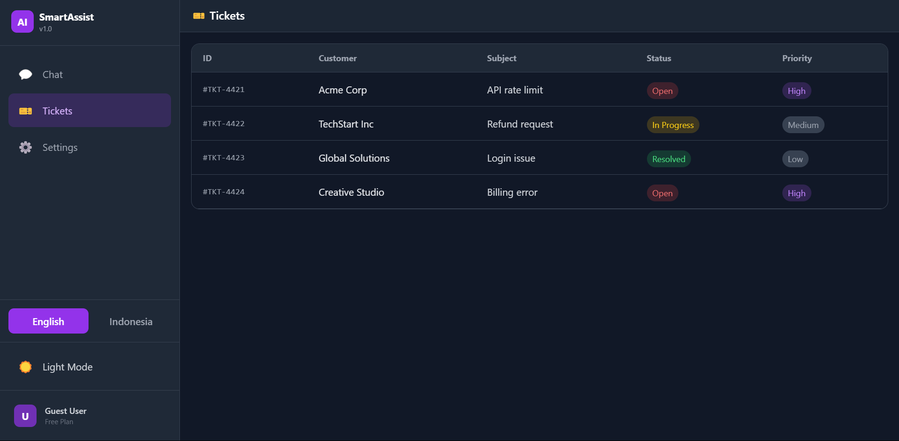
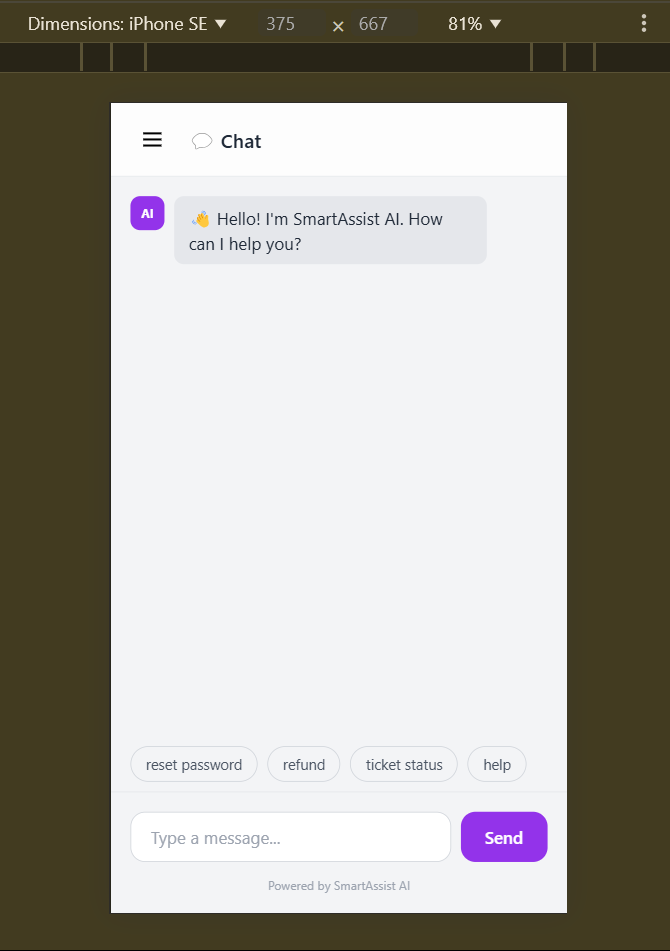

# SmartAssist AI - Customer Support Dashboard

## 📌 Overview

SmartAssist AI is a modern, AI-powered customer support dashboard designed to streamline support operations. Features intelligent chat, ticket management, dark/light mode, and multilingual support.

## ✨ Features

| Feature | Description |
|---------|-------------|
| 🤖 AI Chat | Smart responses with intent recognition |
| 🎫 Ticket System | Track and manage support tickets |
| 🌓 Dark/Light Mode | Seamless theme switching |
| 🌐 Multilingual | English & Indonesian support |
| 📱 Responsive | Works on all devices |

## 🖼️ Screenshots

| Dark Mode | Light Mode |
|-----------|------------|
|  |  |

| Tickets Page | Mobile View |
|--------------|-------------|
|  |  |

## 🛠️ Tech Stack

- **Framework:** Next.js 14
- **Styling:** Tailwind CSS
- **Language:** TypeScript
- **Icons:** Emoji
- **Deployment:** Vercel

## 🚀 Live Demo

**https://smartassist-ai-dashboard.vercel.app**

## 📁 Project Structure
